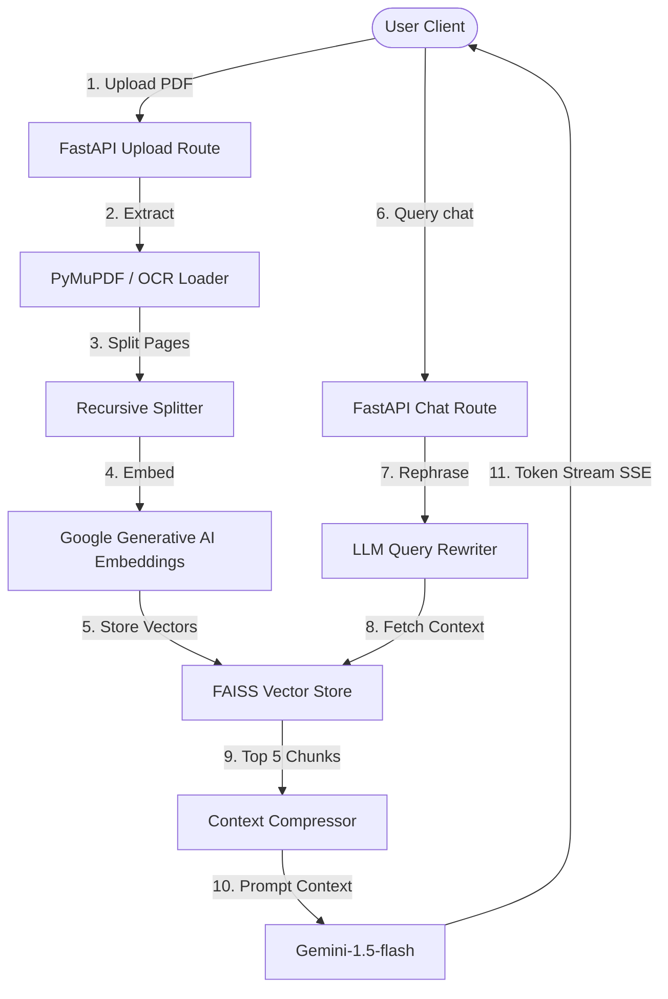

# DocAssistant - Production-Ready AI PDF Chatbot

DocAssistant is a complete, full-stack AI Document Assistant built using **FastAPI**, **LangChain**, **React + Vite**, **Tailwind CSS**, and **Google Gemini API**. 

The system implements advanced RAG (Retrieval-Augmented Generation) patterns to ingest standard and scanned PDFs, index chunks into a local FAISS vector database, and provide a conversational chatbot interface featuring Server-Sent Events (SSE) streaming, conversation aware query rewriting, and page-level source citations.

---

## Architecture Overview



---

## Folder Structure

```text
docassistant/
├── backend/
│   ├── app/
│   │   ├── api/
│   │   │   ├── chat.py         # Chat, history lists, history deletion
│   │   │   ├── health.py       # API status diagnostics
│   │   │   ├── summary.py      # Summaries & insights generation
│   │   │   └── upload.py       # Multi-PDF upload & statistics
│   │   ├── services/
│   │   │   ├── chunking.py     # Recursive splitting
│   │   │   ├── conversation.py # Chat history & memory buffers
│   │   │   ├── embedding.py    # Google Embeddings loader
│   │   │   ├── pdf_loader.py   # Fitz reader & OCR fallback
│   │   │   ├── rag_chain.py    # SSE stream & query rewrite
│   │   │   └── vector_store.py # FAISS database operations
│   │   ├── utils/
│   │   │   ├── config.py       # Pydantic Settings
│   │   │   ├── helpers.py      # Keyword, wordcount, reading time helpers
│   │   │   └── logger.py       # Structured logs configuration
│   │   └── main.py             # App entry & static assets mount
│   ├── requirements.txt        # Python packages list
│   └── .env.example            # Environment variables template
├── frontend/
│   ├── src/
│   │   ├── components/
│   │   │   └── Sidebar/
│   │   │       └── Sidebar.jsx # Navigation & database wipes
│   │   ├── pages/
│   │   │   ├── AnalysisPage.jsx# Summaries & FAQs tabs
│   │   │   ├── ChatPage.jsx    # Chatbot & citations panel
│   │   │   └── DashboardPage.jsx# Drag-drop upload & stats
│   │   ├── services/
│   │   │   └── api.js          # Axios & SSE stream fetch client
│   │   ├── App.jsx             # Theme & Routing shell
│   │   ├── index.css           # CSS entry & Glassmorphism styles
│   │   └── main.jsx            # React root mount
│   ├── tailwind.config.js      # CSS configuration
│   ├── postcss.config.js       # PostCSS processor rules
│   ├── vite.config.js          # Proxy settings
│   ├── index.html              # HTML shell
│   └── package.json            # NPM packages list
├── Dockerfile                  # Multi-stage production image build
├── docker-compose.yml          # Container configuration
└── README.md                   # System documentation
```

---

## Environment Variables

Create a `.env` file in the `backend/` directory (or specify in your deployment platform's environment settings).

```env
# Gemini API Key (Required)
GEMINI_API_KEY=your_google_gemini_api_key

# Optional settings
PORT=8000
HOST=0.0.0.0
ENVIRONMENT=development # Set to "production" in cloud environments
```

---

## Installation & Local Setup

### System Prerequisites
To support scanned PDF OCR extraction, your machine must have **Tesseract OCR** and **Poppler** installed.
- **Windows**: Install Tesseract via `vcpkg` or installer and add it to system `PATH`. Install Poppler via `conda` or download binaries and append to `PATH`.
- **macOS**: `brew install tesseract poppler`
- **Linux (Ubuntu/Debian)**: `sudo apt-get install tesseract-ocr poppler-utils`

### Running the Backend
1. Navigate to the `backend/` directory:
   ```bash
   cd backend
   ```
2. Create and activate a python virtual environment:
   ```bash
   python -m venv venv
   # On Windows:
   venv\Scripts\activate
   # On macOS/Linux:
   source venv/bin/activate
   ```
3. Install dependencies:
   ```bash
   pip install -r requirements.txt
   ```
4. Run the Uvicorn server:
   ```bash
   python -m uvicorn app.main:app --reload
   ```
   The backend API will be available at `http://127.0.0.1:8000`.

### Running the Frontend
1. Navigate to the `frontend/` directory:
   ```bash
   cd ../frontend
   ```
2. Install npm dependencies:
   ```bash
   npm install
   ```
3. Run the development server:
   ```bash
   npm run dev
   ```
   The React application will launch at `http://localhost:5173`. Any API calls to `/upload`, `/chat`, `/history`, `/summary` etc., are automatically proxied to the backend at `http://127.0.0.1:8000`.

---

## Deployment Options

### Docker Deployment
The root of the repository contains a multi-stage `Dockerfile` and a `docker-compose.yml` to launch the entire application, serving the compiled React frontend directly through FastAPI static files on port `8000`.

1. To build and run with Docker Compose, run:
   ```bash
   docker-compose up --build
   ```
2. Open `http://localhost:8000` in your browser.

### Cloud Providers (Render, Railway, AWS, Heroku)
Since the app can compile into a single container:
1. Link your Github repository.
2. Select **Docker** or **Web Service** deployment.
3. Configure the environment variable: `GEMINI_API_KEY`.
4. Render/Railway will automatically build the React assets and run the FastAPI server, exposing port `8000`.

---

## API Documentation

For interactive OpenAPI docs, navigate to `http://localhost:8000/docs` when the backend is running.

### 1. Ingest PDF Document
- **Endpoint**: `POST /upload`
- **Payload**: Multipart file data (`files`)
- **Response**:
  ```json
  {
    "message": "Successfully processed 1 file(s).",
    "documents": [
      {
        "filename": "annual_report.pdf",
        "original_filename": "Annual Report.pdf",
        "pages": 12,
        "word_count": 4820,
        "reading_time_min": 24,
        "language": "English",
        "file_size": "2.4 MB",
        "upload_time": "2026-07-14T20:00:00Z",
        "top_keywords": ["revenue", "growth", "margin", "customers"]
      }
    ]
  }
  ```

### 2. Conversational RAG Chat
- **Endpoint**: `POST /chat`
- **Payload**:
  ```json
  {
    "question": "What is the company's revenue growth?",
    "session_id": "optional-uuid-string",
    "search_type": "mmr",
    "filter_filename": "annual_report.pdf"
  }
  ```
- **Response**: SSE text-stream containing `event: citations` followed by token chunks of `event: message`.

### 3. Generate Summaries
- **Endpoint**: `POST /summary`
- **Payload**: `{"filename": "optional_name.pdf"}`
- **Response**: Returns keys `short_summary`, `detailed_summary`, `bullet_summary`, `key_insights`, `important_dates`, `important_numbers`, `important_people`, `important_organizations`.

### 4. Extra AI Insights
- **Endpoint**: `POST /questions`
- **Payload**: `{"filename": "optional_name.pdf"}`
- **Response**: Returns keys `faqs` (list of Q&A), `keywords`, `topics`, `executive_summary`, `glossary`, `timeline`, `action_items`, `important_definitions`.

---

## Future Improvements
- Add persistent storage database support (e.g. PostgreSQL + pgvector) for cloud deployments.
- Support login and User Role accounts access permissions.
- Integrate advanced citation link highlights mapping scroll offsets inside an embedded PDF viewer canvas.
"# doc_assistant" 
